# User Guide
* [Wand at a Glance](#wand-at-a-glance)
* [Prerequisites](#prerequisites)
* [Prepartion Steps](#preparation-steps)
  * [Get Source Code](#get-source-code)
  * [Building Images](#building-images)
  * [Configure Settings](#configure-settings)
  * [Prepare to start](#prepare-to-start)
  * [Start Service](#start-service)
* [Basic Instruction](#basic-instruction)
  * [Visit Gogs in browser](#visit-gogs-in-browser)
  * [Sign up user in Gogs](#sign-up-user-in-gogs)
  * [Sign in Gogs](#sign-in-gogs)
  * [Create Repository](#create-repository)
  * [Clone Repository](#clone-repository)
  * [Create .travis.yml file](#create-.travis.yml-file)
  * [Submit changes to Gogs repository](#submit-changes-to-gogs-repository)
* [Jenkins CI Portion](#jenkins-ci-portion)
  * [Visit Jenkins master in browser](#visit-jenkins-master-in-browser)
  * [Jenkins job runs at specified slave node](#jenkins-job-runs-at-specified-slave-node)
  * [View Jenkins job running console log](#view-jenkins-job-running-console-log)

## Wand at a Glance
Wand composed with two key components of which Gogs and Jenkins setup a typical DevOps workflow automatically.
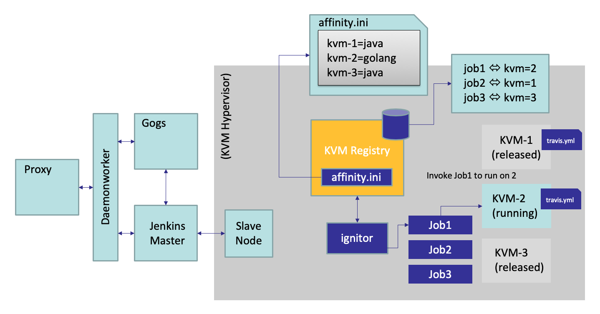
## Prerequisites

* Docker 17.09 or newer versions
* docker-compose 1.17 or newer versions
* CentOS 7.4 or newer versions

## Prepartion Steps

### Get Source Code

 * Clone repository from Github

 ```sh
 git clone https://github.com/inspursoft/wand.git
```

### Building Images

* Build Images via docker-compose

```sh
docker-compose build
```

### Configure Settings

* Set configurations at __devops.cfg__

```sh
# Set available IP and port as current host for running Gogs service, leave default port if not conflict
gogits_host_ip = 10.0.0.0
gogits_host_port=10088
gogits_ssh_port=10025

# Set available IP and port as current host for running Jenkins service, leave default port if not conflict
jenkins_host_ip=10.0.0.0
jenkins_host_port=8089
jenkins_node_ip=10.0.0.0
jenkins_node_ssh_port=22

# Set correct SSH username/password for the Jenkins slave node
jenkins_node_username=root
jenkins_node_password=123456a?
# Set directory to store Jenkins slave agent files, leave default if not conflict
jenkins_node_volume=/data/jenkins_node

# Set correct KVM size as provided from KVM hypervisor
kvm_registry_size = 4
# Set KVM registry service port, leave default if not conflict
kvm_registry_port = 8890
# Set KVM toolkits where to store
kvm_toolkits_path = /root/kvm_toolkits
```

### Prepare to start

* Execute __*prepare*__ script to generate config files

```sh
sh prepare
```

**Note:** This process would use Docker __golang:1.9.6__ image to compile __kvmregistry__ component of which provides KVM register service for running multi KVMs as Jenkins slave nodes, it should take a while to run for the first time.

### Start service

* Start up DevOps services by using __docker-compose__

```sh
docker-compose up -d
```

## Basic Instruction

### Visit Gogs in browser

* Locate URL via __*<gogits_host_ip>:<gogits_host_port>*__

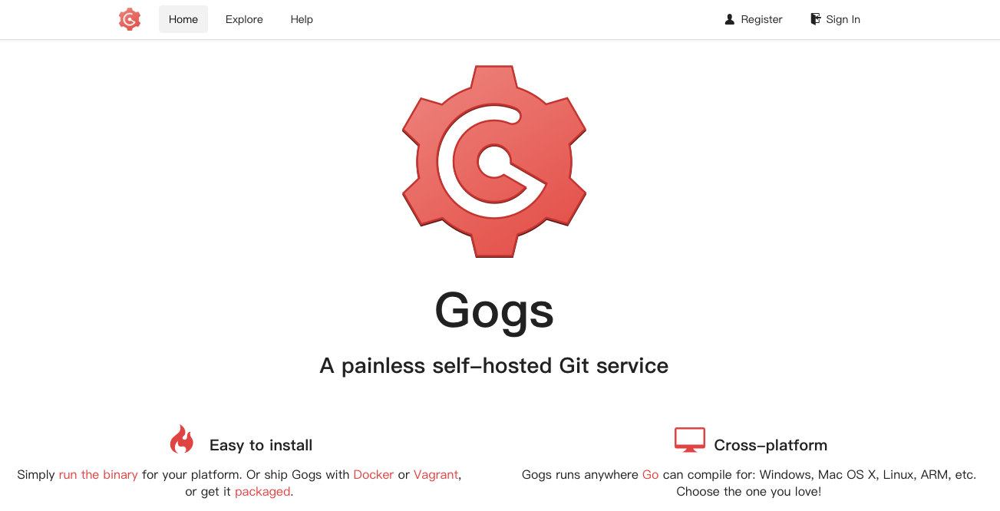


### Sign up user in Gogs

* Sign up user in Gogs
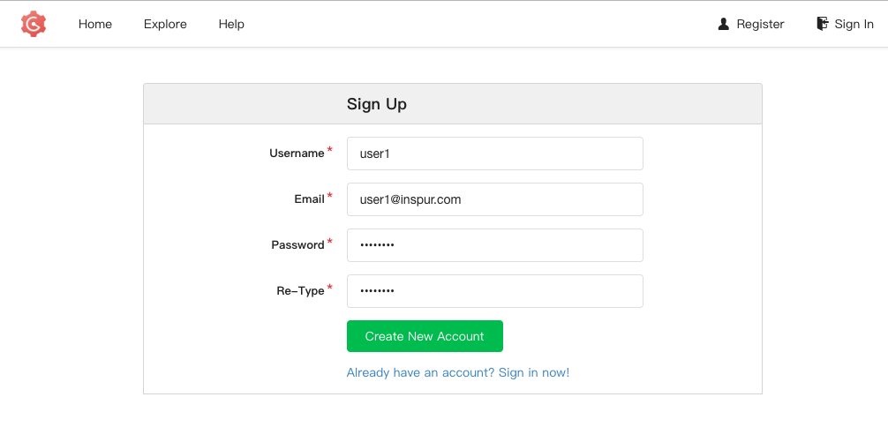

### Sign in Gogs

* Sign in Gogs with registered account
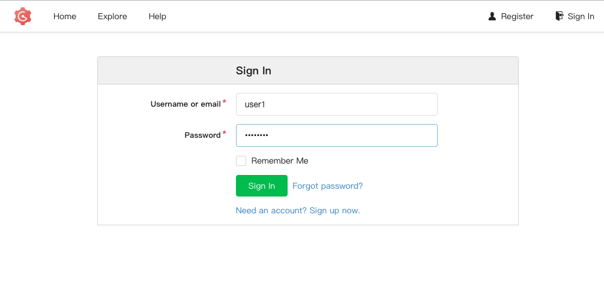
* After user signed in
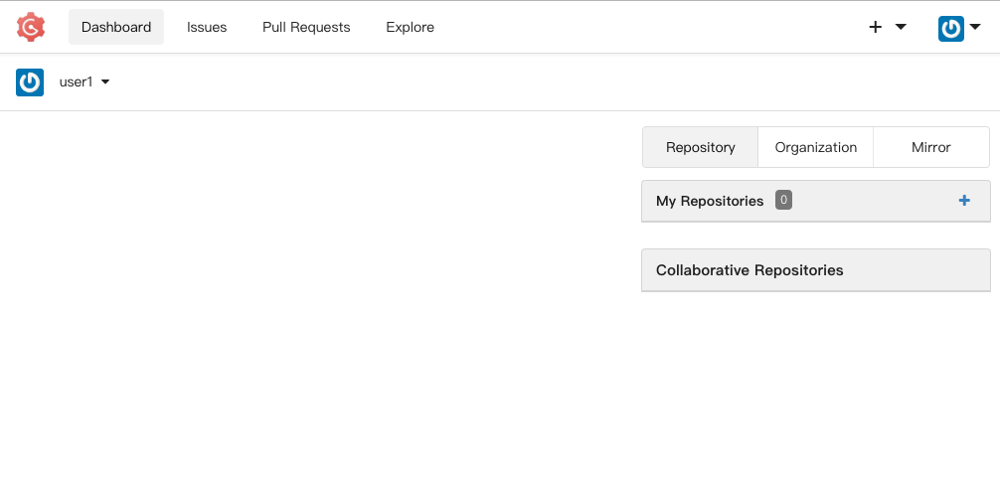

### Create repository

* Create Git repository in Gogs
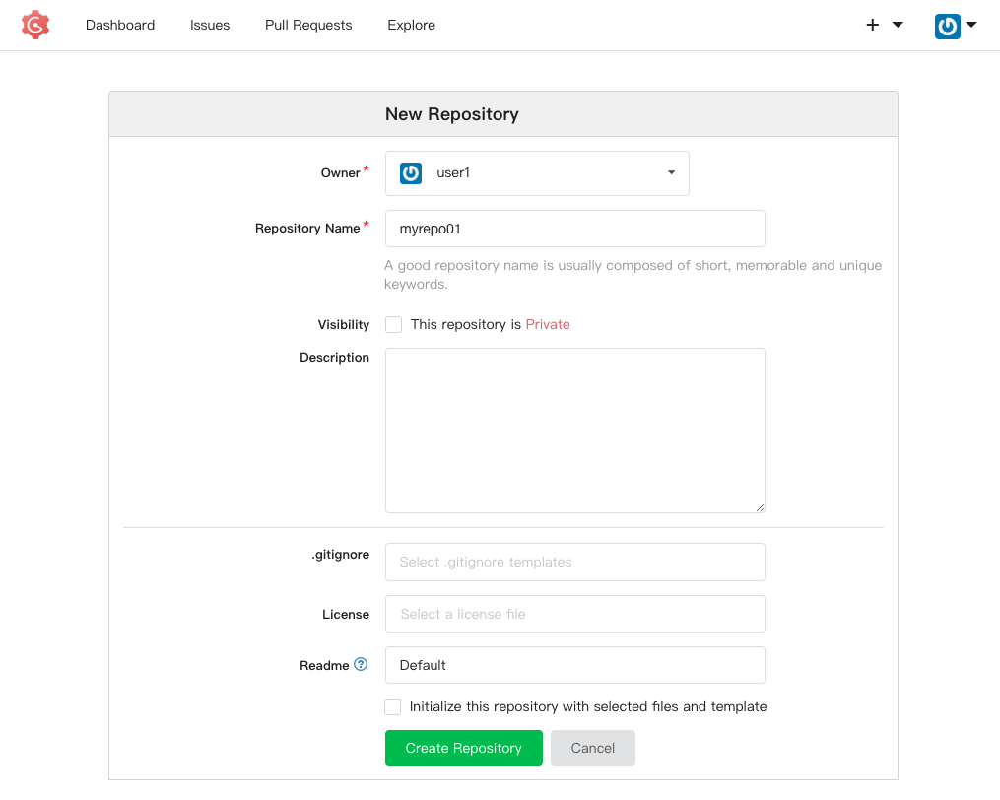

### Clone repository

* Copy repository URL created in Gogs
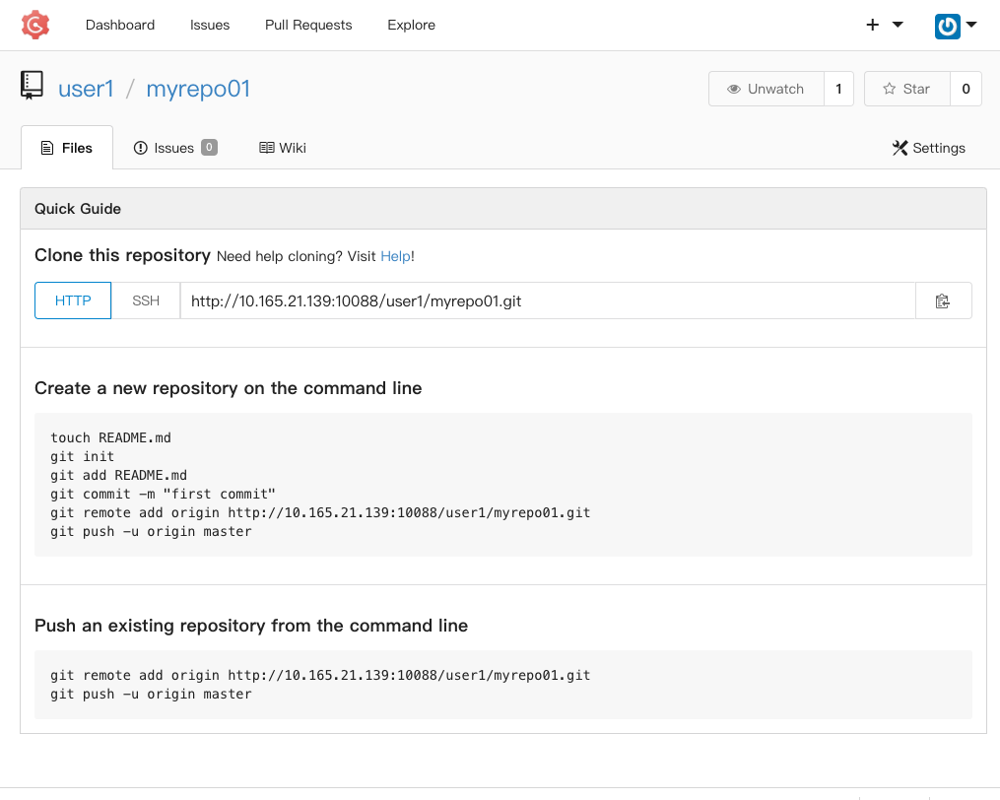

* Clone into your local environment
```sh
git clone http://10.165.21.139:10088/user1/myrepo01.git
```

### Create __.travis.yml__ file

* Create __.travis.yml__ file in your cloned repository
```sh
cd myrepo01
```

```sh
vi .travis.yml
```
* This example will set two environment variables, output to console and execute shell script __**ls -al**__ 
```sh
---
env:
  - username=root
  - password=123456
script:
  - echo $username
  - echo $password
  - ls -al
```
**NOTE:** Please refer this [document](https://docs.travis-ci.com/) on how to write your custom travis file. 

### Submit changes to Gogs repository

* Submit changes including __.travis.yml__ file to Gogs repository

```sh
git add .
```

```sh
git commit -m 'Initial commit'
```

```sh
git push origin master
```

## Jenkins CI Portion

### Visit Jenkins master in browser

* Locate Jenkins in brower via __*<jenkins_host_ip>:<jenkins_host_port>*__

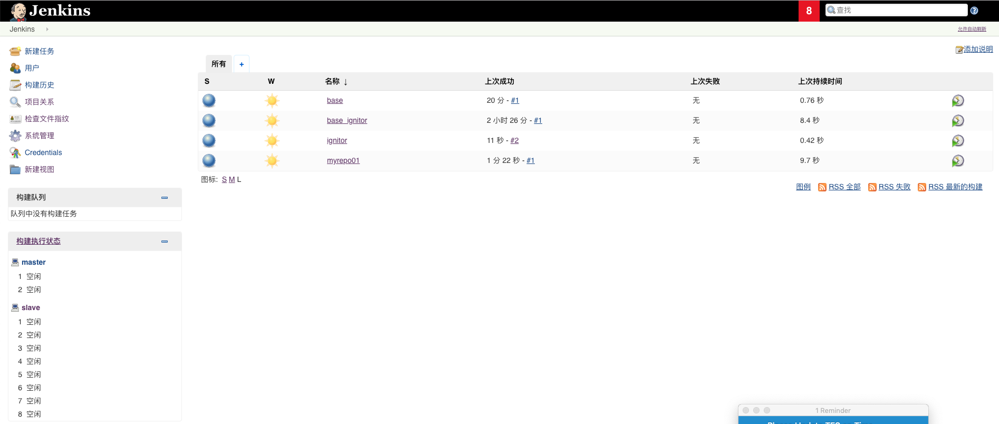 

* The Jenkins job was created as cooresponding Gogs repository

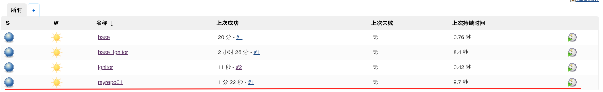

### Jenkins job runs at specified slave node

* Jenkins __**myrepo01**__ job is running at __**kvm-3**__ node which was allocated by the KVM registry service randomly.

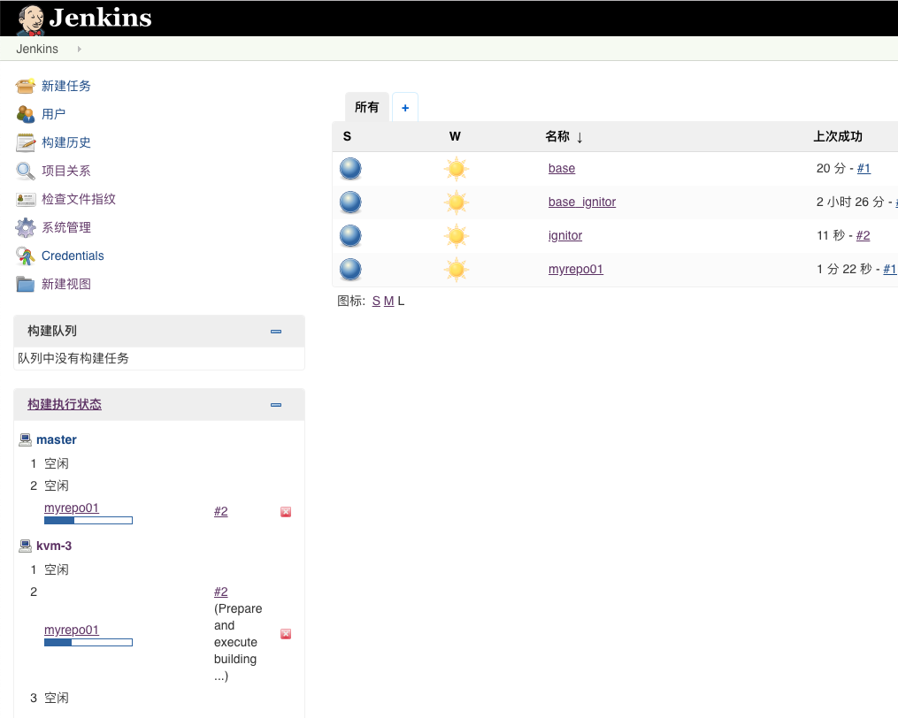

### View Jenkins job running console log.

* Jenkins job has been set some configuration items as __**ENV**__ forms.

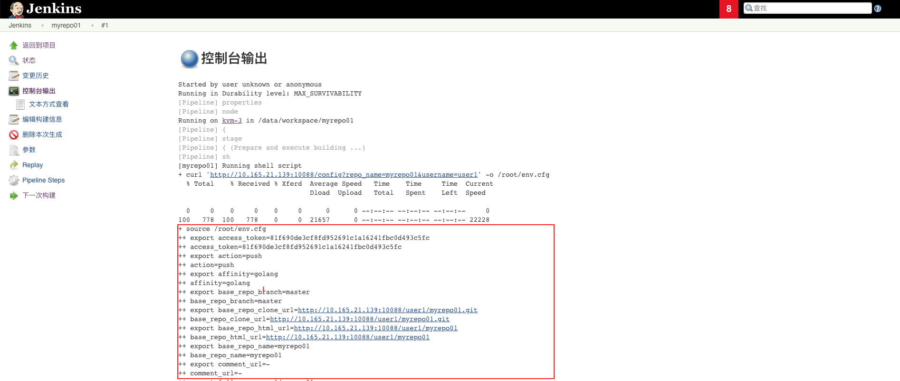

* Jenkins job was executed as __**.travis.yml**__ described.

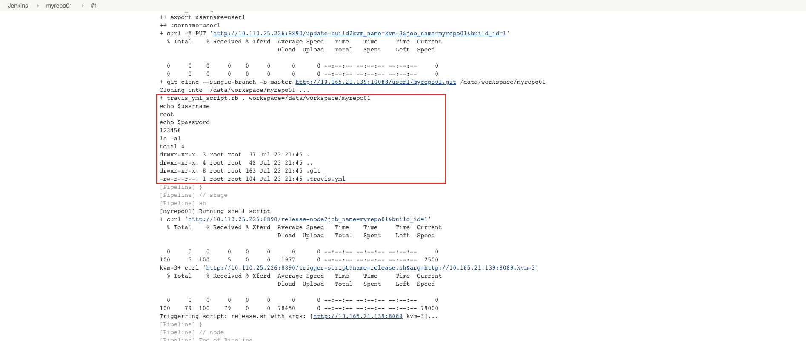